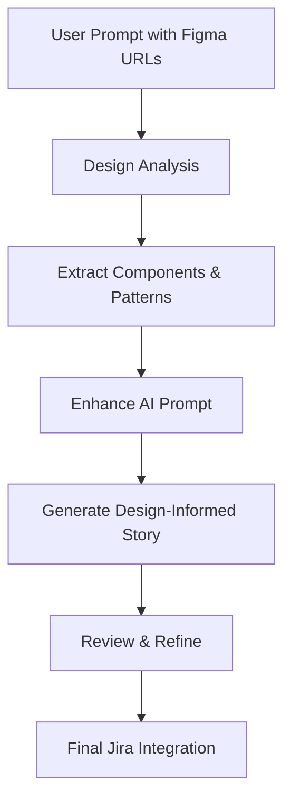

# Enhanced Workflow with Figma Integration

This example demonstrates the complete workflow integration showing how design context flows through the entire user story generation process.

## Workflow Architecture



## Step-by-Step Integration Example

### 1. User Input with Design References
```
Create a user story for implementing a new project creation wizard.
The wizard should guide users through project setup with templates.
Design: https://www.figma.com/design/PROJECT123/Project-Wizard
Components: https://www.figma.com/design/COMPONENTS456/UI-Kit
Fix versions: 8.9.0, QC Severity: High
```

### 2. Design Analysis Phase

#### Figma MCP Calls Made:
```python
# Extract design metadata
metadata = await figma_mcp.get_metadata(
    file_key="PROJECT123",
    node_id="1:2"  # Project Wizard frame
)

# Get component specifications
components = await figma_mcp.get_code(
    file_key="COMPONENTS456",
    node_id="1:10"  # Button component
)
```

#### Extracted Design Information:
**Components:**
- WizardStep component with progress indicator
- ProjectTemplateCard with hover effects
- PrimaryButton and SecondaryButton variants
- FormInput with validation states

**Patterns:**
- Multi-step wizard with progress tracking
- Template selection with preview cards
- Form validation with real-time feedback

**Constraints:**
- Minimum 4 steps, maximum 8 steps in wizard
- Template cards: 300x200px with 2:1 aspect ratio
- Progress indicator: 8px height with rounded ends

### 3. Enhanced Prompt Generation

The system automatically creates an enhanced prompt:

```
You are creating a comprehensive user story following ShortPoint's template structure.

USER REQUEST: Create a user story for implementing a new project creation wizard. The wizard should guide users through project setup with templates.

DESIGN CONTEXT AVAILABLE:
## Available Design Components
- **WizardStep** (FRAME): width: 800, height: 600
- **ProjectTemplateCard** (COMPONENT): width: 300, height: 200, background: #FFFFFF
- **PrimaryButton** (COMPONENT): width: 120, height: 40, background: #007BFF
- **ProgressIndicator** (COMPONENT): width: 100%, height: 8

## Interaction Patterns from Design
- Wizard steps have click navigation with progress tracking
- Template cards have hover states with preview expansion
- Form inputs have focus states and validation feedback

## Design Constraints
- Wizard container minimum width: 800px
- Progress indicator height: 8px with rounded ends
- Template cards maintain 2:1 aspect ratio

INSTRUCTIONS FOR DESIGN INTEGRATION:
- Reference specific components from the design context in the DESIGN section
- Include design patterns and interaction requirements in FUNCTIONAL DETAILS
- Add design system validation to TESTING & VALIDATION
- Ensure all design constraints are documented in SPECIAL CASES/EDGE CASES

GENERATE A COMPLETE USER STORY...
```

### 4. Design-Informed Story Generation

The AI generates a comprehensive story with design integration:

---

**Title:** `[Project Management] Implement Project Creation Wizard with Templates`

### **FEATURE CONTEXT**

This feature introduces a guided project creation wizard that walks users through project setup using pre-designed templates. It addresses the need for standardized project initialization while reducing setup time and ensuring consistency across projects.

The feature will benefit project managers, team leads, and administrators who regularly create new projects, providing an intuitive, design-driven experience that ensures all necessary project parameters are configured correctly.

---

### **ACCEPTANCE CRITERIA**

**Scenario 1: Wizard Initialization**
- **Given** the user clicks "Create New Project"
- **When** the project creation wizard opens
- **Then** Step 1 (Project Type Selection) should be active with template cards displayed

**Scenario 2: Template Selection**
- **Given** the user is on Step 1 of the wizard
- **When** the user hovers over a template card
- **Then** the card should expand to show preview content and the "Use Template" button should become prominent

**Scenario 3: Progress Tracking**
- **Given** the user navigates between wizard steps
- **When** the user moves to any step
- **Then** the progress indicator should update to show current step and completed steps with visual distinction

---

### **DESIGN**

- Designs provided in Figma: https://www.figma.com/design/PROJECT123/Project-Wizard
- Component library: https://www.figma.com/design/COMPONENTS456/UI-Kit
- Designs approved by UX team with usability testing completed.

#### **Design Components Reference**
- **WizardStep Component**: Multi-step container with progress tracking and navigation controls
- **ProjectTemplateCard**: Interactive card component with hover states and preview functionality
- **PrimaryButton**: Main action button with "Use Template" and "Continue" variants
- **ProgressIndicator**: Visual progress bar showing current step and completion status

#### **Design System Integration**
- **Color Tokens**: Use "primary-500" for active states, "success-500" for completed steps
- **Typography Scale**: Apply "heading-3" for step titles, "body-regular" for descriptions
- **Spacing Values**: Use "spacing-6" between wizard steps, "spacing-4" for card margins
- **Component States**: Include hover, focus, active, and disabled states for all interactive elements

---

### **FUNCTIONAL DETAILS**

- **Wizard Structure**: 5-step process: 1) Template Selection, 2) Project Details, 3) Team Configuration, 4) Settings, 5) Review & Create
- **Template Cards**: Display 6 template options in a 2x3 grid with 300x200px dimensions maintaining 2:1 aspect ratio
- **Progress Tracking**: Visual indicator showing current step, completed steps (filled circles), and remaining steps (outlined circles)
- **Navigation**: Next/Previous buttons with appropriate validation states and "Save Draft" functionality
- **Responsive Behavior**: Wizard adapts to screen sizes with mobile-optimized layout for screens under 768px width
- **Design-driven functionality**: Template card hover effects follow design system "Interactive Card" pattern with smooth transitions and preview expansion

---

### **TESTING & VALIDATION**

**Design Review Needs** - UI/UX validation including:
- Design system compliance verification for all color tokens, typography scales, and spacing values
- Component usage validation against design specifications for wizard and card components
- Interaction pattern testing against design prototypes for smooth hover and focus transitions
- Visual regression testing for design consistency across different browsers and device sizes

### 5. Review and Refinement

User can request changes with design context:

```
"Add more specific validation for the project name field based on the design constraints"
```

The system refines the story while maintaining design integrity:

```
**Scenario 4: Project Name Validation**
- **Given** the user is entering a project name in Step 2
- **When** the user enters a name with special characters
- **Then** display validation message: "Project names should only contain letters, numbers, and spaces"
```

### 6. Final Jira Integration

The complete design-informed story is posted to Jira with:
- All design references preserved
- Specific component requirements documented
- Design system integration requirements included
- Comprehensive testing criteria with design validation

## Benefits of This Integration

### For Product Managers
- Stories automatically include design specifications
- Reduced need for design handoffs and clarifications
- Faster story creation with comprehensive requirements

### For Developers
- Clear design component references for implementation
- Specific interaction patterns and constraints documented
- Design system integration requirements explicit

### For Designers
- Design decisions captured in development requirements
- Reduced implementation deviations from design intent
- Clear testing criteria for design validation

### For QA Teams
- Specific design validation requirements included
- Component and interaction testing clearly defined
- Accessibility and usability testing criteria documented

## Configuration Requirements

To enable this enhanced workflow:

1. **Figma MCP Setup**: Configure Figma access tokens and file permissions
2. **Design File Mapping**: Map Jira components to Figma design files
3. **Template Updates**: Use the enhanced user story template with design sections
4. **Prompt Enhancement**: Enable automatic design context inclusion in AI prompts

This integration transforms the user story creation process from generic requirements to design-informed, implementation-ready specifications that bridge the gap between design and development teams.
