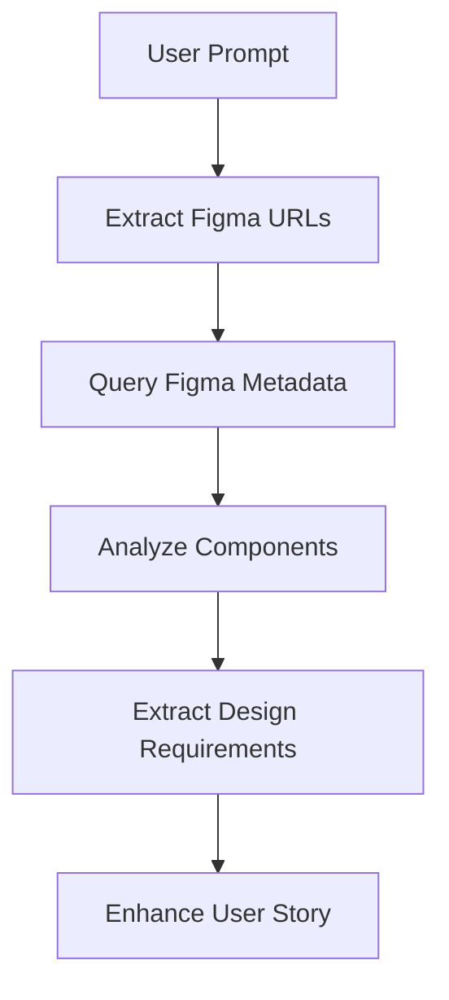

# Figma MCP Integration Configuration

This document outlines how to configure and use Figma MCP integration for design-informed user story generation.

## Prerequisites

- **Figma MCP Server**: Configured and accessible in Cursor
- **Design File Access**: Permissions to relevant Figma project files
- **Design System Knowledge**: Understanding of ShortPoint's design patterns

## Configuration Options

### Required Settings

```json
{
  "figma": {
    "enabled": true,
    "default_file_key": "your-default-figma-file-key",
    "design_system_file": "design-system-file-key",
    "api_timeout": 30000
  }
}
```

### Environment Variables

```bash
FIGMA_ACCESS_TOKEN=your-figma-access-token
FIGMA_TEAM_ID=your-figma-team-id
```

## Supported Figma MCP Operations

### Design Analysis
- **get_metadata**: Extract component hierarchy and structure
- **get_code**: Generate UI code from designs (for reference)
- **get_screenshot**: Capture design screenshots

### Design System Integration
- **Component Library**: Access to reusable UI components
- **Design Tokens**: Colors, typography, spacing values
- **Pattern Library**: Common interaction patterns

## Integration Workflow

### 1. Design Context Extraction


### 2. Design-Driven Story Generation
- **Component Requirements**: Extract from design specifications
- **Interaction Patterns**: Based on design interactions
- **Visual Constraints**: Colors, spacing, typography from design tokens
- **Accessibility**: Design system accessibility guidelines

## Configuration Example

```python
# figma_integration.py
FIGMA_CONFIG = {
    "enabled": True,
    "files": {
        "design_system": "https://www.figma.com/design/SYSTEM_KEY/System-Name",
        "component_library": "https://www.figma.com/design/COMPONENTS_KEY/Components",
        "current_project": "https://www.figma.com/design/PROJECT_KEY/Current-Project"
    },
    "extraction_rules": {
        "include_comments": True,
        "include_specifications": True,
        "include_interactions": True,
        "max_depth": 3
    }
}
```

## Usage Guidelines

### When to Use Figma Integration
- ✅ New features with existing designs
- ✅ UI/UX improvements to existing components
- ✅ Design system updates
- ✅ Accessibility improvements

### When NOT to Use
- ❌ Purely backend features without UI
- ❌ API-only changes
- ❌ Database schema modifications
- ❌ Infrastructure changes

## Design Data Extraction

### Component Information
- Component names and variants
- Design specifications (dimensions, colors, typography)
- Interaction states (hover, focus, disabled)
- Accessibility attributes

### Pattern Recognition
- Common user flows
- Navigation patterns
- Form interaction patterns
- Error state handling

## Error Handling

### Design Access Issues
- Fallback to template defaults when designs unavailable
- Clear error messages for missing design files
- Graceful degradation for incomplete design data

### Integration Failures
- Continue with manual story creation
- Log design-related errors for review
- Provide alternative design input methods

## Best Practices

### Design File Organization
1. **Consistent Naming**: Use clear, descriptive component names
2. **Design Annotations**: Include functional requirements in design notes
3. **Component Documentation**: Document interaction patterns and constraints
4. **Version Control**: Keep design files synchronized with development

### Story Enhancement
1. **Specific References**: Include specific component names and variants
2. **Visual Requirements**: Detail spacing, colors, and typography needs
3. **Interaction Details**: Describe expected behavior from designs
4. **Design Constraints**: Document any design limitations or requirements

## Testing Integration

### Design Validation
- Verify component references exist in design files
- Check design system compliance
- Validate accessibility requirements

### Story Quality
- Ensure design-driven requirements are testable
- Verify design references are specific and actionable
- Confirm design constraints are properly documented

## Future Enhancements

- **Automated Design Validation**: Check stories against design system rules
- **Design Change Detection**: Flag when designs change after story creation
- **Component Version Tracking**: Track which design versions were used
- **Design Debt Tracking**: Identify outdated design references
